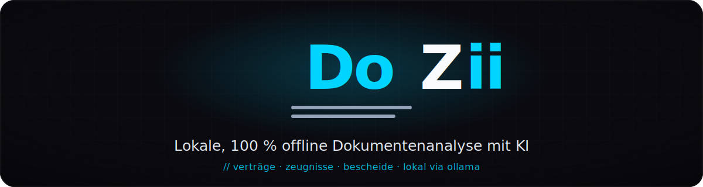

<div align="center">



<h1>DoZii</h1>

<p><b>Lokale, 100&nbsp;% offline Dokumentenanalyse mit KI.</b><br />
Verträge, Arbeitszeugnisse, Bescheide und Briefe verständlich machen — komplett auf
deinem Rechner. Keine Cloud, keine Telemetrie, kein CDN.</p>

<p>
  <a href="https://github.com/haZiinstinct/DoZii/releases/latest/download/DoZii-Setup.exe"></a>
</p>

<p>
  <a href="https://github.com/haZiinstinct/DoZii/actions/workflows/ci.yml"></a>
  
  
  
  
  
  
</p>

<sub><a href="#-highlights">Highlights</a> · <a href="#-die-5-analyse-modi">Analyse-Modi</a> · <a href="#-loslegen">Loslegen</a> · <a href="#-datenschutz--datenablage">Datenschutz</a> · <a href="#-entwicklung">Entwicklung</a></sub>

</div>

---

DoZii liest deine Dokumente und erklärt sie dir — auf Wunsch als Rechtschreibprüfung,
als Umformulierung, als Zusammenfassung, als **Arbeitszeugnis-Decoder** oder als freie
Frage im Chat. Die KI läuft dabei über ein **lokales** [Ollama](https://ollama.com) auf
deinem eigenen Rechner: Sensible Unterlagen wie Verträge, Zeugnisse oder Amtsbescheide
verlassen deinen Computer **nie**.

Kein Login, kein Abo, kein Hochladen. Eine strikte Content-Security-Policy blockiert
jeden Netzwerkzugriff außer zu deinem lokalen Ollama — DoZii funktioniert vollständig
offline.

## ✨ Highlights

- 📄 **5 Analyse-Modi** — Rechtschreibung & Grammatik, Formulierungen, Arbeitszeugnis-Decoder, Zusammenfassung, Freie Frage
- 🕵️ **Arbeitszeugnis-Decoder** — der Star: **Dual-Grading** (Inhalts- *und* Struktur-Note), **80+ versteckte Codes** der deutschen Zeugnissprache, evidenzbasierte Befunde mit **2-Pass-Verifizierung** gegen Halluzinationen
- 🌍 **9 Sprachen — UI *und* KI-Ausgabe** — Deutsch, English, Español, Français, Português, Русский, العربية (mit RTL-Layout), 日本語, 中文; die Analyse folgt deiner Oberflächensprache, nicht der Dokumentsprache
- 📎 **Alle wichtigen Formate** — PDF, DOCX, XLSX und Bilder/Scans per **OCR** (Tesseract, Deutsch + Englisch, lokal gebündelt)
- 💬 **Persistenter Chat pro Dokument** — nach der Analyse einfach weiter mit der KI diskutieren, Verlauf wird gespeichert
- ⚡ **Auto-Ersteindruck** — beim Import erkennt DoZii, worum es geht, und schlägt den passenden Analyse-Modus vor
- 🧠 **Hardware-aware** — erkennt CPU/RAM/GPU und empfiehlt ein passendes Modell (von `qwen2.5:3b` bis `mistral-small:24b`)
- 🔌 **Ollama-Lifecycle in der App** — Start/Stop/Status direkt per Button, kein Terminal nötig
- 🔒 **100&nbsp;% offline** — strikte CSP blockiert alle externen Requests, keine Telemetrie; Fonts, Icons und OCR-Daten sind lokal gebündelt
- 🔄 **Auto-Update** — optional über GitHub Releases, überträgt nur die Versionsnummer, abschaltbar
- ✅ **Produktionsreif** — v1.2.0 mit Installer, Auto-Update, CI (Typecheck · Lint · Format · Tests · Build) auf jeden Push

## 🖼️ Screenshots

> 📸 *Screenshots folgen in Kürze* — ein Blick in die App: Welcome-Wizard mit
> Hardware-Erkennung, Dokument-Upload mit Auto-Ersteindruck, der Arbeitszeugnis-Decoder
> mit Dual-Grading, der Chat und die Einstellungen.

<!-- Sobald die Bilder unter docs/ liegen, diesen Block einkommentieren:
<div align="center">
  
  <br /><br />
  
  
</div>
-->

## 📋 Die 5 Analyse-Modi

| Modus | Was er macht |
| --- | --- |
| ✍️ **Rechtschreibung & Grammatik** | Findet echte Fehler nach Duden-Standard und filtert bloße Stilmeinungen heraus — mit Zitat und Korrekturvorschlag |
| 💬 **Formulierungen** | Verbessert Wortwahl und Satzfluss, ohne den Sinn zu verändern |
| 🕵️ **Arbeitszeugnis-Decoder** | Dekodiert 80+ versteckte Codes, vergibt eine Inhalts- **und** eine Struktur-Note und verifiziert jeden Befund in einem zweiten Durchgang |
| 📝 **Zusammenfassung** | Bringt lange Dokumente auf ihre Kernaussagen |
| ❓ **Freie Frage** | Stell eine beliebige Frage zum Dokument — und chatte anschließend weiter |

## 🚀 Loslegen

1. **[`DoZii-Setup.exe` herunterladen](https://github.com/haZiinstinct/DoZii/releases/latest)** und installieren.
2. Beim ersten Start hilft der **Welcome-Wizard**: er erkennt deine Hardware und führt dich durch das Ollama-Setup.
3. **[Ollama](https://ollama.com/download)** installieren (falls noch nicht vorhanden) und ein Modell laden — DoZii schlägt passend zur Hardware vor:
   ```bash
   ollama pull qwen2.5:3b     # solide Wahl für die meisten CPUs
   ```
4. Dokument reinziehen, Modus wählen, analysieren — und bei Bedarf im Chat nachhaken.

> **SmartScreen-Hinweis:** Der Installer ist (noch) nicht code-signiert. Windows zeigt
> beim ersten Start „Unbekannter Herausgeber" — über **„Weitere Informationen" →
> „Trotzdem ausführen"** geht es weiter.

**Voraussetzungen**

- Windows 10/11 (64-bit)
- [Ollama](https://ollama.com/download) installiert (DoZii hilft beim Einrichten)
- Mind. 8&nbsp;GB RAM; 16&nbsp;GB+ oder eine GPU mit 8&nbsp;GB+ VRAM für stärkere Modelle

## 🔒 Datenschutz & Datenablage

- Alle Dokumente, Analysen, Chats und Einstellungen liegen lokal unter `%APPDATA%\DoZii`
- Logs (14 Tage, **ohne** Dokumentinhalte) ebenfalls dort unter `logs\`
- Einziger Netzwerkzugriff neben Ollama (`localhost:11434`): der **optionale** Update-Check gegen GitHub — in den Einstellungen abschaltbar
- Bei der Deinstallation fragt der Uninstaller, ob deine Nutzerdaten mitgelöscht werden sollen

## 🛠️ Entwicklung

Electron 33 · electron-vite · React 19 · TypeScript (strict) · Tailwind CSS v4 ·
better-sqlite3 + Drizzle ORM · Ollama · unpdf / mammoth / xlsx / tesseract.js.
Qualität gesichert durch CI (Typecheck · Lint · Format · Tests · Build) auf jeden Push.

```bash
npm install
npm run dev          # Dev-Server mit Hot-Reload (Ollama muss laufen)
npm run typecheck    # TypeScript (main + renderer)
npm run lint         # ESLint
npm test             # Vitest (nutzt node:sqlite, benötigt Node >= 24)
npm run build        # Production-Build
npm run build:win    # Windows-Installer (.exe)
```

Voraussetzungen: Node.js >= 24, laufendes Ollama mit mindestens einem Modell. Der
Release-Prozess ist in [`docs/RELEASE_CHECKLIST.md`](docs/RELEASE_CHECKLIST.md)
dokumentiert; der Installer heißt bewusst versionslos `DoZii-Setup.exe`, damit der Link
[`releases/latest/download/DoZii-Setup.exe`](https://github.com/haZiinstinct/DoZii/releases/latest/download/DoZii-Setup.exe)
über alle Releases stabil bleibt.

## ⚠️ Bekannte Grenzen

Ehrlich ist besser als überverkauft:

- **Windows-only** — aktuell nur ein NSIS-Installer für Windows 10/11, kein macOS/Linux
- **Installer nicht signiert** — SmartScreen warnt beim ersten Start (siehe oben); kein Sicherheitsproblem, aber eine Hürde
- **Ollama ist separat** — muss einmal installiert und ein Modell geladen werden (die App hilft dabei)
- **i18n KI-gestützt** — die 9 Übersetzungen sind maschinell erstellt; Verbesserungen von Muttersprachlern sind als PR willkommen

## 🤝 Mitmachen

Issues und Pull Requests sind willkommen — Details in [CONTRIBUTING.md](CONTRIBUTING.md).

## 📄 Lizenz

[MIT](LICENSE) — © haZii. Gebündelte Open-Source-Komponenten sind in
[THIRD_PARTY_LICENSES.md](THIRD_PARTY_LICENSES.md) aufgeführt.

<div align="center"><sub>Built by <a href="https://hazii.org">haZii</a> · <code>// webdesign: haZii.org</code></sub></div>
